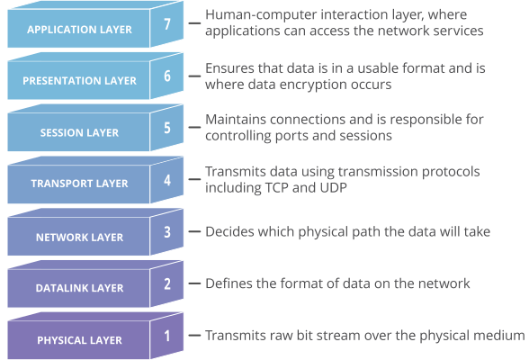

<h1>Webserv<h1>

## OSI Model

the OSI Model provides a standard for different computer systems to be able to communicate with each other.

The OSI Model can be seen as a universal language for computer networking. It’s based on the concept of splitting up a communication system into seven abstract layers, each one stacked upon the last.

